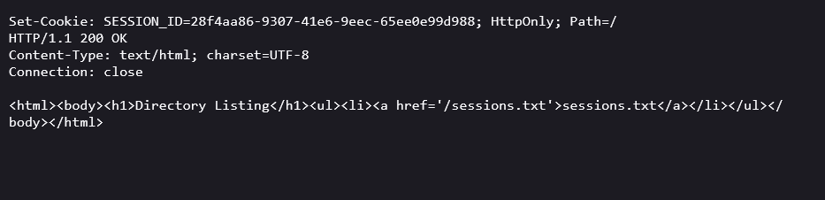

# Full-Fledged HTTP Server


🚀 A robust and scalable HTTP server implemented in Java.

## Features

- 📡 **HTTP/1.1 Support**: Fully compliant with the HTTP/1.1 protocol.
- 🔒 **Secure**: Supports HTTPS for secure communication.
- ⚡ **High Performance**: Optimized for high concurrency and low latency.
- 🔧 **Configurable**: Easily customizable through configuration files.
- 📊 **Logging**: Comprehensive logging for monitoring and debugging.

## Getting Started

### Prerequisites

- Java Development Kit (JDK) 11 or higher
- Maven

### Installation

1. Clone the repository:
   ```sh
   git clone https://github.com/yourusername/full-fledged-http-server.git
   ```
2. Navigate to the project directory:
   ```sh
   cd full-fledged-http-server
   ```
3. Build the project using Maven:
   ```sh
   mvn clean install
   ```

### Usage

1. Run the server:
   ```sh
   java -jar target/http-server.jar
   ```
2. Open your browser and navigate to `http://localhost:8080`.

## Configuration

The server can be configured using the `config.properties` file located in the `src/main/resources` directory. Here is an example configuration:

```properties
server.port=8080
In HTTP, the Connection: close header is used to indicate that the server will close the connection after sending the response. This is often used in situations where the server doesn't expect the client to send additional requests over the same connection.
```

## Contributing

Contributions are welcome! Please fork the repository and submit a pull request.

## License

This project is licensed under the MIT License. See the [LICENSE](LICENSE) file for details.

## Screenshots




## Contact

For any questions or feedback, please contact [yourname@example.com](mailto:yourname@example.com).

---

Made with ❤️ by [Kunj Shah](https://github.com/KunjShah95)
